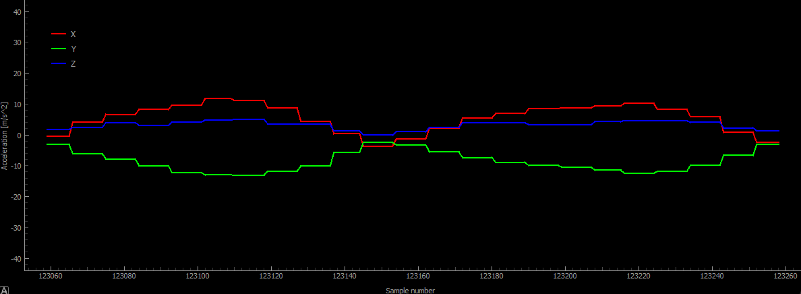
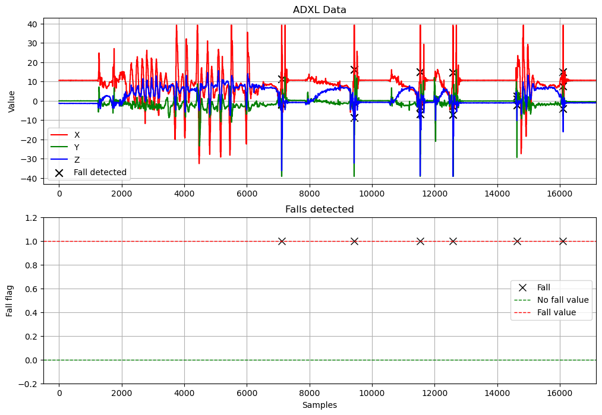
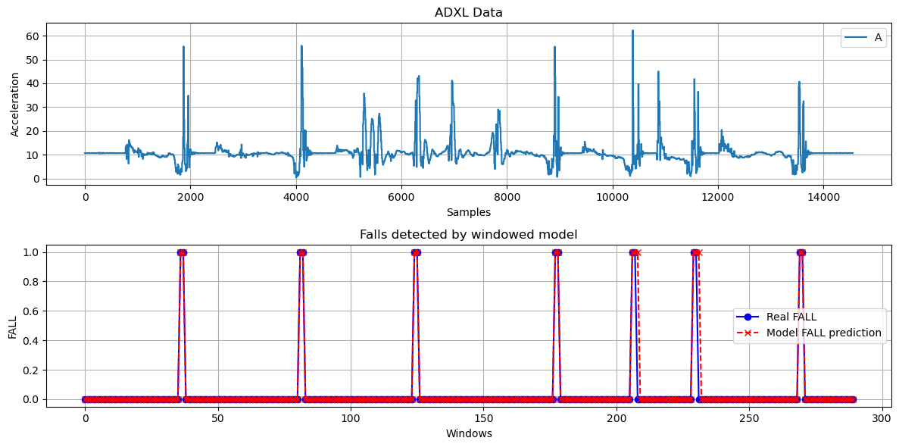
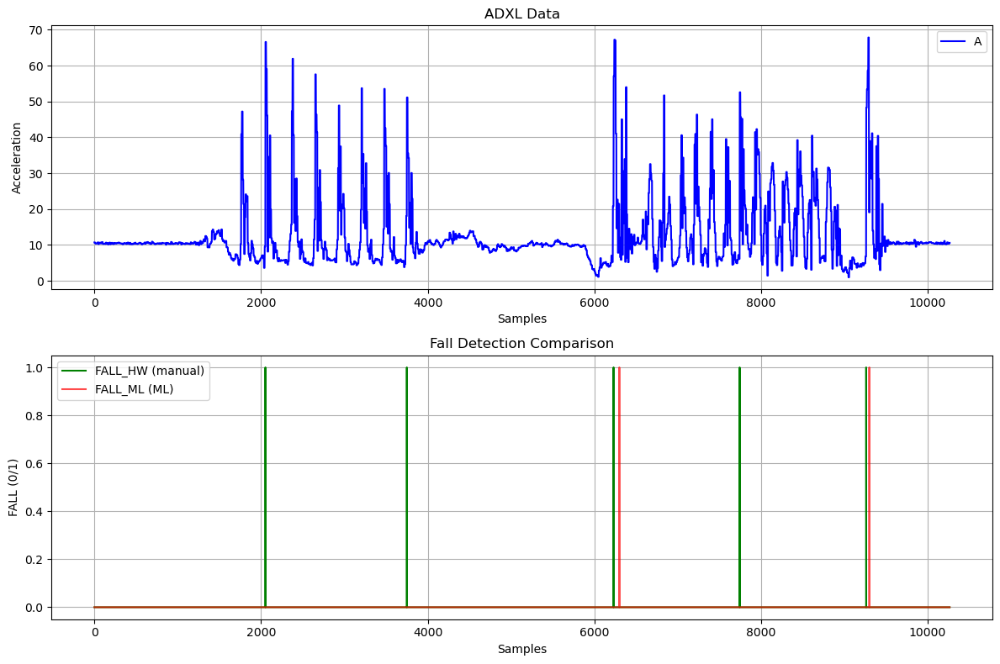

# Wykrywanie upadku z użyciem ADXL345 i STM32F103

## 1. Wprowadzenie
Projekt ma na celu wykrywanie upadku z wykorzystaniem akcelerometru ADXL345 oraz mikrokontrolera STM32F103.
Dane z czujnika są przesyłane do komputera przez interfejs USB, gdzie mogą być analizowane i wizualizowane.
Opracowano dwa podejścia:
1. **Algorytm manualny** - oparty o progi i analize próbek z czujnika
2. **Model uczenia maszynowego** - oparty o klasyfikator trenujący się na zbiorach danych przy pracy czujnika

Najważniejsze ręczne zmiany w kodzie źródłowym znajdują się w plikach:
- `main.c` – główna logika programu, wykrywanie upadku, konfiguracja parametrów.
- `adxl345.c` – obsługa komunikacji z czujnikiem ADXL345.

Pozostałe pliki zostały wygenerowane i modyfikowane automatycznie przez środowisko STM32CubeIDE.

## 2. Środowisko programistyczne
- **STM32CubeIDE** – główne środowisko programistyczne do konfiguracji i pisania kodu na STM32F103.
- **Dodatkowe narzędzia** – Python 3.11, biblioteki: `pandas`, `numpy`, `matplotlib`, `scikit-learn`, `xgboost`, `joblib`, `csv`, `serial`, `pyqtgraph`, `PyQt5`

## 3. Instrukcja uruchomienia projektu
1. W STM32CubeIDE należy wybrać odpowiedni mikrokontroler (STM32F103).
2. Skonfigurować wejścia/wyjścia oraz interfejsy komunikacyjne:
   - I2C dla komunikacji z ADXL345,
   - USB (CDC) dla przesyłania danych do PC.
3. Wgrać program do mikrokontrolera.
4. Uruchomić jeden z programów w Pythonie:
   - `rx_adxl.py` – do odczytu w konsoli,
   - `rx_adxl_visualization.py` – do wizualizacji na wykresie,
   - `rx_adxl_with_ml.py` – do łączenia algorytmu manualnego i ML.
5. Programy w Pythonie kończymy za pomocą `Ctrl+C` (**KeyInterrupt**). Dane automatycznie zapisują się do pliku `.csv`.
6. Dane można następnie analizować w Jupyter Notebook.

## 4. Komunikacja
W projekcie zastosowano dwie magistrale komunikacyjne:
- **I2C** – komunikacja pomiędzy akcelerometrem ADXL345 a mikrokontrolerem STM32.
- **USB** (CDC) – komunikacja pomiędzy STM32 a komputerem PC.
Dane pomiarowe są przesyłane cyklicznie do komputera i mogą być przetwarzane na różne sposoby.

## 5. Programy do odbioru danych
### 5.1. `rx_adxl.py`
Skrypt w Pythonie umożliwiający odczyt danych i wyświetlanie ich w konsoli.
```text
X, Y, Z, FALL
7.27, -7.31, 0.99, 0
7.27, -7.31, 0.99, 0
7.27, -7.31, 0.99, 0
7.27, -7.31, 0.96, 0
7.27, -7.31, 0.96, 0
7.27, -7.31, 0.96, 0
7.27, -7.31, 0.96, 0
```
### 5.2. `rx_adxl_visualization.py`
Program do wizualizacji danych w czasie rzeczywistym na wykresach.

### 5.3 `rx_adxl_with_ml.py`
Program który łączył algorytm manualny z uczeniem maszynowym
```text
X=-3.86, Y=5.01, Z=-3.48, FALL_HW=0
X=-3.86, Y=5.01, Z=-3.48, FALL_HW=0
X=-3.86, Y=5.01, Z=-3.48, FALL_HW=0

--- OKNO #34 ---
{'X_mean': 5.46, 'Y_mean': -1.98, 'Z_mean': 5.33, 'A_mean': 9.45, 'DX_mean': -0.09, 'DY_mean': 0.07, 'DZ_mean': -0.07, 'DA_mean': -0.04, 'FALL': 0}
Predykcja ML: 0
---------------

X=-2.53, Y=-3.37, Z=-9.83, FALL_HW=0
X=-2.53, Y=-3.37, Z=-9.83, FALL_HW=0
X=-2.53, Y=-3.37, Z=-9.83, FALL_HW=0
```

## 6. Algorytm manualny
W implementacji manualnej wykorzystano proste warunki:
- jeśli wartość przyspieszenia spadła poniżej określonego progu (`FREEFALL_LIMIT_MS2`), licznik `freeFallCount` był inkrementowany,
- licznik ten był resetowany, gdy sygnał wracał do normy szybciej niż po x próbkach (TUTAJ SPRAWDZ NAZWE ZMIENNEJ I NAPISZ)
- aby uznać zdarzenie za upadek, musiało to trwać przez określoną liczbę próbek (np. 30–50),
- dodatkowy warunek na minimalną różnicę między kolejnymi próbkami (np. > 20), aby odróżnić upadek od machania ręką,
- dodatkowo po spadku musiał nastąpić szybki wzrost (peak) sygnału.
Parametry wykrywania upadku:
```c
#define FREEFALL_LIMIT_MS2   6.0f
#define FREEFALL_MIN_SAMPLES 200
#define IMPACT_THRESHOLD     50.0f
#define IMPACT_DELTA_MIN     20.0f
#define DEBOUNCE_TIME_MS     1000
```
- **FREEFALL_LIMIT_MS2** – graniczna wartość przyspieszenia (m/s²), poniżej której traktujemy ruch jako swobodny spadek.
- **FREEFALL_MIN_SAMPLES** – minimalna liczba próbek, przez które spadek musi trwać, aby został uznany.
- **IMPACT_THRESHOLD** – minimalna wartość przyspieszenia po spadku, interpretowana jako uderzenie.
- **IMPACT_DELTA_MIN** – różnica wartości między kolejnymi próbkami, aby odróżnić uderzenie od machania.
- **DEBOUNCE_TIME_MS** – minimalny czas pomiędzy kolejnymi detekcjami upadków.
### Ograniczenia algorytmu manualnego
- wrażliwość na ustawione parametry progowe,
- trudności z odróżnieniem nietypowych ruchów od faktycznego upadku,
- możliwe fałszywe alarmy przy szybkim machaniu modułem.

## 7. Uczenie maszynowe
### 7.1. Okna czasowe
Pojedyńcza próbka `X, Y, Z` nie niesie wystarczającej informacji. Zamiast tego stosowano **okna czasowe** (np. 150–160 próbek).
Dla każdego okna liczono dodatkowe cechy (features), aby ująć **dynamikę sygnału w czasie**, a nie tylko chwilowe wartości.

### 7.2. Ekstrahowane cechy
Dla każdej osi **X, Y, Z**, a także sygnałów pochodnych:
- **A** – całkowite przyspieszenie (`sqrt(X^2 + Y^2 + Z^2)`) TUTAJ SPRAWDZ CZY DA SIE ROWNANIE NAPISAC,
- **DX, DY, DZ, DA** – różnice kolejnych próbek,
```python
df = pd.read_csv('data/nowe_dane.csv')
df["A"] = np.sqrt(df["X"]**2 + df["Y"]**2 + df["Z"]**2)
df["DX"] = df["X"].diff().fillna(0)
df["DY"] = df["Y"].diff().fillna(0)
df["DZ"] = df["Z"].diff().fillna(0)
df["DA"] = df["A"].diff().fillna(0)
df.to_csv("data/train_features.csv", index=False)
```

wyliczano zestaw cech statystycznych:
- średnia (`mean`),
- odchylenie standardowe (`std`),
- minimum i maksimum,
- zakres (max – min),
- energia sygnału (`sum(x^2)`).
```python
def extract_features(window):
    features = {}
    for col in ["X", "Y", "Z", "A", "DX", "DY", "DZ", "DA"]:
        data = window[col]
        features[f"{col}_mean"] = data.mean()
        features[f"{col}_std"] = data.std()
        features[f"{col}_min"] = data.min()
        features[f"{col}_max"] = data.max()
        features[f"{col}_range"] = data.max() - data.min()
        features[f"{col}_energy"] = np.sum(data**2)
    features["FALL"] = window["FALL"].max()
    return features
```

Te cechy tworzyły wektor wejściowy dla modelu ML.

### 7.3. Modele ML
Przetestowane modele:
- **Random Forest** (200 drzew, z balansowaniem klas),
- **XGBoost** (200 drzew, `scale_pos_weight` dla klas niezrównoważonych).
Oba modele działały dobrze, jednak **ostatecznie wybrano Random Forest**, ponieważ dawał wysoką dokładność i był prostszy do wdrożenia.
### Zalety uczenia maszynowego
- większa odporność na nietypowe ruchy,
- możliwość adaptacji modelu do nowych danych,
- mniejsza liczba fałszywych alarmów.

## 8. Analiza danych w Jupyter Notebook
### 8.1. Wykrywanie upadku przez algorytm manualny

### 8.2. Wykrywanie upadku przez model

Do porównania wykorzystano program `rx_adxl_with_ml.py`, który równolegle:
- odbierał dane z akcelerometru,
- stosował algorytm manualny,
- oraz predykcję ML.


## 9. Możliwe rozszerzenia
- Wdrożenie modelu ML bezpośrednio na mikrokontrolerze (np. przy użyciu **STM32Cube.AI**).
- Dodanie komunikacji bezprzewodowej (Bluetooth, WiFi) zamiast USB.
- Rozszerzenie o dodatkowe czujniki (np. żyroskop, barometr).
- Wprowadzenie klasyfikacji typów upadków (np. upadek do przodu, na bok, do tyłu).
